# Entity-Relationship Diagram

Every business table has a direct or transitive `account_id → accounts(id) ON DELETE CASCADE`
foreign key (the tenant-isolation column), and most also carry an audit `user_id`/`created_by`/
`owner_user_id` → `auth.users(id)`. To keep the diagram legible, the `→ auth.users` audit edges
are called out once here rather than drawn on every entity:

> `accounts.owner_user_id`, `profiles.user_id`, `account_invitations.created_by_user_id` /
> `accepted_by_user_id`, and the `user_id`/`created_by`/`assigned_agent_id`/`assigned_to`/
> `actor_user_id` columns on `contacts`, `conversations`, `pipelines`, `automations`, `flows`,
> `broadcasts`, `deals`, `contact_notes`, `custom_fields`, `tags`, `quick_replies`, `api_keys`,
> `webhook_endpoints`, `ai_configs`, `ai_knowledge_documents`, `notifications`, `automation_logs`,
> `automation_pending_executions`, `flow_runs` — **all reference `auth.users(id)`**, mostly
> `ON DELETE CASCADE` (a few `SET NULL`, `accounts.owner_user_id` is `ON DELETE RESTRICT` —
> an account can't lose its owner without an explicit ownership transfer, see `transfer-ownership` route).

## Diagram — business/domain relationships

```mermaid
erDiagram
    ACCOUNTS ||--o{ PROFILES : "members"
    ACCOUNTS ||--o{ ACCOUNT_INVITATIONS : "invites"
    ACCOUNTS ||--o| WHATSAPP_CONFIG : "one number"
    ACCOUNTS ||--o{ CONTACTS : "owns"
    ACCOUNTS ||--o{ CONVERSATIONS : "owns"
    ACCOUNTS ||--o{ PIPELINES : "owns"
    ACCOUNTS ||--o{ DEALS : "owns"
    ACCOUNTS ||--o{ BROADCASTS : "owns"
    ACCOUNTS ||--o{ AUTOMATIONS : "owns"
    ACCOUNTS ||--o{ FLOWS : "owns"
    ACCOUNTS ||--o{ AI_CONFIGS : "owns"
    ACCOUNTS ||--o{ API_KEYS : "owns"
    ACCOUNTS ||--o{ WEBHOOK_ENDPOINTS : "owns"
    ACCOUNTS ||--o{ TAGS : "owns"
    ACCOUNTS ||--o{ CUSTOM_FIELDS : "owns"
    ACCOUNTS ||--o{ NOTIFICATIONS : "owns"
    ACCOUNTS ||--o{ QUICK_REPLIES : "owns"
    ACCOUNTS ||--o{ MESSAGE_TEMPLATES : "owns"

    CONTACTS ||--o{ CONVERSATIONS : "has"
    CONTACTS ||--o{ CONTACT_TAGS : "tagged"
    TAGS ||--o{ CONTACT_TAGS : "applied to"
    CONTACTS ||--o{ CONTACT_CUSTOM_VALUES : "has"
    CUSTOM_FIELDS ||--o{ CONTACT_CUSTOM_VALUES : "defines"
    CONTACTS ||--o{ CONTACT_NOTES : "has"
    CONTACTS ||--o{ DEALS : "linked to"
    CONTACTS ||--o{ BROADCAST_RECIPIENTS : "targeted by"
    CONTACTS ||--o{ AUTOMATION_LOGS : "triggered"
    CONTACTS ||--o{ FLOW_RUNS : "engaged in"

    CONVERSATIONS ||--o{ MESSAGES : "contains"
    CONVERSATIONS ||--o{ MESSAGE_REACTIONS : "has"
    MESSAGES ||--o{ MESSAGE_REACTIONS : "reacted to"
    MESSAGES ||--o| MESSAGES : "reply_to"
    CONVERSATIONS ||--o{ DEALS : "linked to"
    CONVERSATIONS ||--o{ AI_USAGE_LOG : "logged"
    CONVERSATIONS ||--o{ FLOW_RUNS : "runs in"
    CONVERSATIONS ||--o{ NOTIFICATIONS : "about"

    PIPELINES ||--o{ PIPELINE_STAGES : "has"
    PIPELINES ||--o{ DEALS : "contains"
    PIPELINE_STAGES ||--o{ DEALS : "holds"
    PROFILES ||--o{ DEALS : "assigned_to"

    BROADCASTS ||--o{ BROADCAST_RECIPIENTS : "sends to"

    AUTOMATIONS ||--o{ AUTOMATION_STEPS : "has"
    AUTOMATION_STEPS ||--o{ AUTOMATION_STEPS : "parent/branch"
    AUTOMATIONS ||--o{ AUTOMATION_LOGS : "logs"
    AUTOMATIONS ||--o{ AUTOMATION_PENDING_EXECUTIONS : "queues"
    AUTOMATION_LOGS ||--o{ AUTOMATION_PENDING_EXECUTIONS : "resumes"
    AUTOMATION_STEPS ||--o{ AUTOMATION_PENDING_EXECUTIONS : "parent_step"

    FLOWS ||--o{ FLOW_NODES : "has"
    FLOWS ||--o{ FLOW_RUNS : "executes"
    FLOW_RUNS ||--o{ FLOW_RUN_EVENTS : "logs"
    MESSAGES ||--o| FLOW_RUNS : "last_prompt_message"

    AI_KNOWLEDGE_DOCUMENTS ||--o{ AI_KNOWLEDGE_CHUNKS : "chunked into"

    ACCOUNTS {
        uuid id PK
        text name
        uuid owner_user_id FK
        text default_currency
    }
    PROFILES {
        uuid id PK
        uuid user_id FK
        uuid account_id FK
        enum account_role "owner|admin|agent|viewer"
    }
    WHATSAPP_CONFIG {
        uuid id PK
        uuid account_id FK "UNIQUE"
        text phone_number_id "UNIQUE globally"
        text access_token "AES-256-GCM"
    }
    CONTACTS {
        uuid id PK
        uuid account_id FK
        text phone
        text phone_normalized
    }
    CONVERSATIONS {
        uuid id PK
        uuid account_id FK
        uuid contact_id FK
        text status
    }
    MESSAGES {
        uuid id PK
        uuid conversation_id FK
        text message_id "Meta wamid, NOT globally unique"
        text status
    }
    DEALS {
        uuid id PK
        uuid account_id FK
        uuid pipeline_id FK
        uuid stage_id FK
        numeric value
    }
```



## Full foreign-key list (live, `pg_constraint`, `public` schema, 90 FKs)

```
account_invitations.accepted_by_user_id  -> auth.users(id)         ON DELETE SET NULL
account_invitations.account_id           -> accounts(id)            ON DELETE CASCADE
account_invitations.created_by_user_id   -> auth.users(id)         ON DELETE SET NULL
accounts.owner_user_id                   -> auth.users(id)         ON DELETE RESTRICT
ai_configs.created_by                    -> auth.users(id)         ON DELETE SET NULL
ai_configs.handoff_agent_id              -> auth.users(id)         ON DELETE SET NULL
ai_configs.account_id                    -> accounts(id)            ON DELETE CASCADE
ai_knowledge_chunks.account_id           -> accounts(id)            ON DELETE CASCADE
ai_knowledge_chunks.document_id          -> ai_knowledge_documents(id) ON DELETE CASCADE
ai_knowledge_documents.account_id        -> accounts(id)            ON DELETE CASCADE
ai_knowledge_documents.created_by        -> auth.users(id)         ON DELETE SET NULL
ai_usage_log.account_id                  -> accounts(id)            ON DELETE CASCADE
ai_usage_log.conversation_id             -> conversations(id)       ON DELETE SET NULL
api_keys.account_id                      -> accounts(id)            ON DELETE CASCADE
api_keys.created_by                      -> auth.users(id)         ON DELETE SET NULL
automation_logs.contact_id               -> contacts(id)            ON DELETE SET NULL
automation_logs.account_id               -> accounts(id)            ON DELETE CASCADE
automation_logs.automation_id            -> automations(id)         ON DELETE CASCADE
automation_logs.user_id                  -> auth.users(id)         ON DELETE CASCADE
automation_pending_executions.log_id         -> automation_logs(id)     ON DELETE CASCADE
automation_pending_executions.account_id     -> accounts(id)            ON DELETE CASCADE
automation_pending_executions.parent_step_id -> automation_steps(id)    ON DELETE SET NULL
automation_pending_executions.automation_id  -> automations(id)         ON DELETE CASCADE
automation_pending_executions.user_id        -> auth.users(id)         ON DELETE CASCADE
automation_pending_executions.contact_id     -> contacts(id)            ON DELETE SET NULL
automations.account_id                   -> accounts(id)            ON DELETE CASCADE
automations.user_id                      -> auth.users(id)         ON DELETE CASCADE
automation_steps.automation_id           -> automations(id)         ON DELETE CASCADE
automation_steps.parent_step_id          -> automation_steps(id)    ON DELETE CASCADE
broadcast_recipients.contact_id          -> contacts(id)            ON DELETE SET NULL
broadcast_recipients.broadcast_id        -> broadcasts(id)          ON DELETE CASCADE
broadcasts.user_id                       -> auth.users(id)         ON DELETE CASCADE
broadcasts.account_id                    -> accounts(id)            ON DELETE CASCADE
contact_custom_values.custom_field_id    -> custom_fields(id)       ON DELETE CASCADE
contact_custom_values.contact_id         -> contacts(id)            ON DELETE CASCADE
contact_notes.contact_id                 -> contacts(id)            ON DELETE CASCADE
contact_notes.account_id                 -> accounts(id)            ON DELETE CASCADE
contact_notes.user_id                    -> auth.users(id)         ON DELETE CASCADE
contacts.account_id                      -> accounts(id)            ON DELETE CASCADE
contacts.user_id                         -> auth.users(id)         ON DELETE CASCADE
contact_tags.contact_id                  -> contacts(id)            ON DELETE CASCADE
contact_tags.tag_id                      -> tags(id)                ON DELETE CASCADE
conversations.contact_id                 -> contacts(id)            ON DELETE CASCADE
conversations.user_id                    -> auth.users(id)         ON DELETE CASCADE
conversations.account_id                 -> accounts(id)            ON DELETE CASCADE
custom_fields.account_id                 -> accounts(id)            ON DELETE CASCADE
custom_fields.user_id                    -> auth.users(id)         ON DELETE CASCADE
deals.contact_id                         -> contacts(id)            ON DELETE SET NULL
deals.account_id                         -> accounts(id)            ON DELETE CASCADE
deals.conversation_id                    -> conversations(id)       (no action / RESTRICT — 041 changed default, verify before relying on it)
deals.assigned_to                        -> profiles(id)            ON DELETE SET NULL
deals.pipeline_id                        -> pipelines(id)           ON DELETE CASCADE
deals.stage_id                           -> pipeline_stages(id)     (no action / RESTRICT)
deals.user_id                            -> auth.users(id)         ON DELETE CASCADE
flow_nodes.flow_id                       -> flows(id)               ON DELETE CASCADE
flow_run_events.flow_run_id              -> flow_runs(id)           ON DELETE CASCADE
flow_runs.contact_id                     -> contacts(id)            ON DELETE SET NULL
flow_runs.last_prompt_message_id         -> messages(id)            ON DELETE SET NULL
flow_runs.user_id                        -> auth.users(id)         ON DELETE CASCADE
flow_runs.flow_id                        -> flows(id)               ON DELETE CASCADE
flow_runs.account_id                     -> accounts(id)            ON DELETE CASCADE
flow_runs.conversation_id                -> conversations(id)       ON DELETE SET NULL
flows.user_id                            -> auth.users(id)         ON DELETE CASCADE
flows.account_id                         -> accounts(id)            ON DELETE CASCADE
member_presence.account_id               -> accounts(id)            ON DELETE CASCADE
member_presence.user_id                  -> auth.users(id)         ON DELETE CASCADE
message_reactions.conversation_id        -> conversations(id)       ON DELETE CASCADE
message_reactions.message_id             -> messages(id)            ON DELETE CASCADE
messages.reply_to_message_id             -> messages(id)            ON DELETE SET NULL
messages.conversation_id                 -> conversations(id)       ON DELETE CASCADE
message_templates.account_id             -> accounts(id)            ON DELETE CASCADE
message_templates.user_id                -> auth.users(id)         ON DELETE CASCADE
notifications.account_id                 -> accounts(id)            ON DELETE CASCADE
notifications.user_id                    -> auth.users(id)         ON DELETE CASCADE
notifications.conversation_id            -> conversations(id)       ON DELETE CASCADE
notifications.contact_id                 -> contacts(id)            ON DELETE SET NULL
notifications.actor_user_id              -> auth.users(id)         ON DELETE SET NULL
pipelines.user_id                        -> auth.users(id)         ON DELETE CASCADE
pipelines.account_id                     -> accounts(id)            ON DELETE CASCADE
pipeline_stages.pipeline_id              -> pipelines(id)           ON DELETE CASCADE
profiles.account_id                      -> accounts(id)            ON DELETE CASCADE
profiles.user_id                         -> auth.users(id)         ON DELETE CASCADE
quick_replies.account_id                 -> accounts(id)            ON DELETE CASCADE
quick_replies.user_id                    -> auth.users(id)         ON DELETE CASCADE
tags.user_id                             -> auth.users(id)         ON DELETE CASCADE
tags.account_id                          -> accounts(id)            ON DELETE CASCADE
webhook_endpoints.account_id             -> accounts(id)            ON DELETE CASCADE
webhook_endpoints.created_by             -> auth.users(id)         ON DELETE SET NULL
whatsapp_config.account_id               -> accounts(id)            ON DELETE CASCADE
whatsapp_config.user_id                  -> auth.users(id)         ON DELETE CASCADE
```

## Notable relationship design choices

- **`accounts.owner_user_id` is `ON DELETE RESTRICT`** — a user row can never be deleted while
  they still own an account; ownership must be transferred first (`POST /api/account/transfer-ownership`).
- **`deals.conversation_id` and `deals.stage_id` have no explicit delete rule** (defaults to `NO ACTION`,
  effectively `RESTRICT`) as of migration 041 — deleting a conversation or pipeline stage that still
  has deals attached will fail rather than cascade or null out. Worth confirming this is intentional
  before any bulk-delete tooling is built for account offboarding.
- **`messages.reply_to_message_id`** is a self-referential FK — quoted-reply chains, `SET NULL` on delete.
- **`automation_steps.parent_step_id`** is self-referential (branching step trees), `CASCADE` — deleting
  a parent step deletes its whole subtree.
- Almost every table cascades from `accounts` (`ON DELETE CASCADE`) — **deleting an account row deletes
  the tenant's entire dataset** in one statement. This is convenient for account offboarding but means
  there is no soft-delete/tombstone safety net at the DB level for tenant deletion — worth a deliberate
  decision (soft-delete flag + scheduled hard-delete, or an application-level confirmation/export flow)
  before this becomes a self-serve SaaS action.
